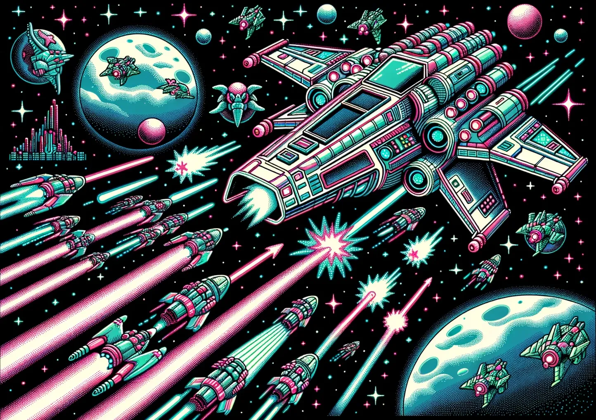

# Cosmic Defender

## Table of Contents
1. [Introduction](#introduction)
2. [Game Overview](#game-overview)
3. [Game Concept](#game-concept)
4. [Target Audience](#target-audience)
5. [Gameplay and Mechanics](#gameplay-and-mechanics)
6. [Game Interface/Interaction](#game-interfaceinteraction)
7. [Possible Programming Languages](#possible-programming-languages)
8. [Conclusion](#conclusion)

---

## Introduction
- **Presenter**: Jeremy Duncan
- **Date**: October 5th, 2023
- **Course**: CEIS420
- **Instructor**: Dr. Liu
- **Objective**: Present a game designed for touchscreen kiosks at O'Hare International Airport.

---

## Game Overview
- **Game Name**: Cosmic Defender
- **Platform**: Web-based, Touchscreen Kiosks
- **Objective**: The primary objective is to defend the galaxy from waves of invading alien spacecraft.
- **Target Audience**: The game aims to entertain passengers of all ages, with a special focus on younger audiences between the ages of 4 and 10.

---

## Game Concept
- **Gameplay Type**: Arcade Shooter
- **Setting**: The game is set in outer space.
- **Player's Role**: Players will control a spaceship equipped with laser guns and shields.
- **Winning Condition**: The game is won when the player successfully clears all the waves without losing all their health.

---

## Target Audience
- **Primary Audience**: Younger passengers aged between 4 and 10.
- **Secondary Audience**: Passengers of all ages.
- **Engagement**: Designed to entertain passengers while they wait for their flights.
- **Leaderboard**: The game will feature a leaderboard to encourage competitive play.

---

## Gameplay and Mechanics
- **Movement**: The spaceship can move in all directions across the screen.
- **Enemies**: Alien spacecraft will appear in waves and move in various patterns.
- **Power-ups**: Power-ups like double lasers, rapid fire, and shields will appear at random intervals.
- **Health Bar**: The game features a health bar, and the game is lost if the health reaches zero.

---

## Game Interface/Interaction
- **Frontend Technologies**: JavaScript, Slim, jQuery
- **Backend Technologies**: Ruby on Rails, PostgreSQL
- **Game Engine**: Phaser.js
- **User Inputs**: The game will be primarily interacted with via touchscreen.

---

## Possible Programming Languages
- **Client-side**: JavaScript, jQuery
- **Server-side**: Ruby, Ruby on Rails
- **Templating**: Slim
- **Database**: PostgreSQL
- **Game Engine**: Phaser.js

---

## Conclusion
- **Summary**: Cosmic Defender aims to provide an entertaining experience for passengers waiting at O'Hare International Airport.
- **Technologies**: The game leverages a tech stack that is both functional and aligned with professional development goals.
